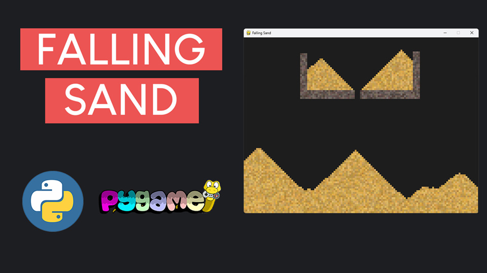

# Falling Sand Simulation with Pygame

This repository contains the code for a video tutorial on creating a **Falling Sand Simulation** using Python and Pygame.

## Video Tutorial

<p align="center">
  
</p>

<p align="center">
🎥 <a href="https://youtu.be/JKv6CwOiIlU">Watch the Video Tutorial on YouTube</a>
</p>

## Overview

In this tutorial, we build an interactive Falling Sand Simulation from scratch. The tutorial walks you through each step, from setting up the grid to implementing various particle behaviors like falling sand and immovable rocks. Along the way, you'll learn Python programming, Pygame basics, and simulation design techniques.

## Features

- **Realistic Particle Physics:** Sand particles fall naturally and interact with rocks to form realistic patterns.
- **Multiple Particle Types:** Add sand, rocks, or erase particles using different modes.
- **Interactive Tools:** Use your mouse and keyboard to dynamically add, remove, and modify particles.
- **Customizable Brush Size:** Create larger patterns with the adjustable brush tool.
- **Dynamic Cursor Feedback:** A custom cursor indicates the selected tool and mode.
- **Optimized Performance:** Grid-based updates ensure smooth simulation even with many particles.

## Code Structure

- **main.py:** The entry point of the project. It sets up the Pygame window, handles user input, and manages the simulation.
- **grid.py:** Contains the `Grid` class, which manages the particle grid and its updates.
- **particle.py:** Defines the `SandParticle` and `RockParticle` classes, along with their behaviors and properties.
- **simulation.py:** Contains the `Simulation` class, which integrates all components and handles interactions.

## How to Run

1. Clone this repository:
   ```bash
   git clone https://github.com/educ8s/falling-sand-simulation.git
   cd falling-sand-simulation
   ```

2. Ensure you have Python and Pygame installed. Install Pygame using pip:
   ```bash
   pip install pygame
   ```

3. Run the `main.py` script:
   ```bash
   python main.py
   ```

## Project Steps

This project is divided into 10 steps:
1. **Install Pygame:** Set up your environment and install the Pygame library.
2. **Create the Window & Simulation Loop:** Set up the Pygame window and define the simulation loop.
3. **Build the Grid:** Create a two-dimensional grid to manage particles.
4. **Add Sand Particles:** Implement the SandParticle class and their visual representation.
5. **Add Simulation Logic:** Define how particles fall and interact with their surroundings.
6. **Optimize Performance:** Refactor the simulation loop for better efficiency.
7. **Add Keyboard Controls:** Use keys to switch between Sand, Rock, and Eraser modes.
8. **Add Rock Particles:** Introduce immovable rocks that interact with sand.
9. **Add Eraser Tool:** Implement a tool to remove particles dynamically.
10. **Add a Cursor Indicator:** Show a dynamic cursor that represents the selected tool.

## Controls

- **Mouse Left Click:** Add particles or erase them based on the current mode.
- **Keyboard Keys:**
  - **S:** Switch to Sand mode.
  - **R:** Switch to Rock mode.
  - **E:** Switch to Eraser mode.
  - **Spacebar:** Clear the entire grid.

## Dependencies

- Python 3.x
- Pygame (Community Edition recommended for better performance)

## Contributing

Contributions are welcome! If you have ideas for new features or improvements, feel free to open an issue or submit a pull request.

## License

This project is licensed under the MIT License. See the LICENSE file for details.

Enjoy building your Falling Sand Simulation and don't forget to share your project! 🚀

